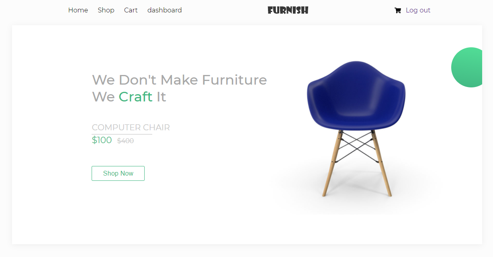
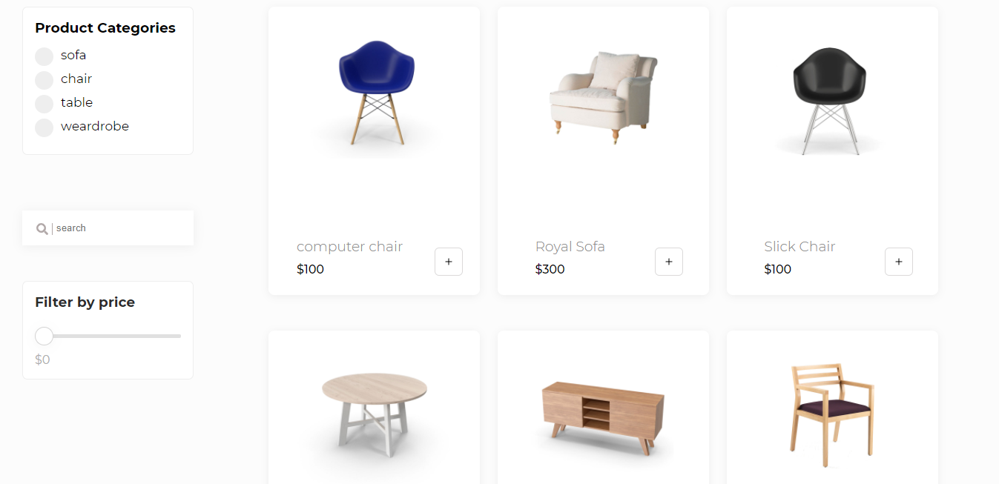
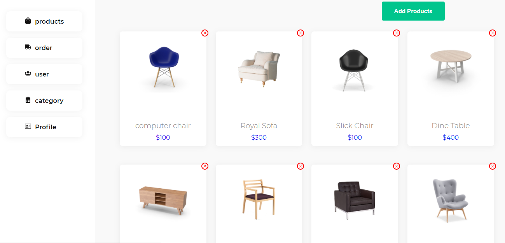
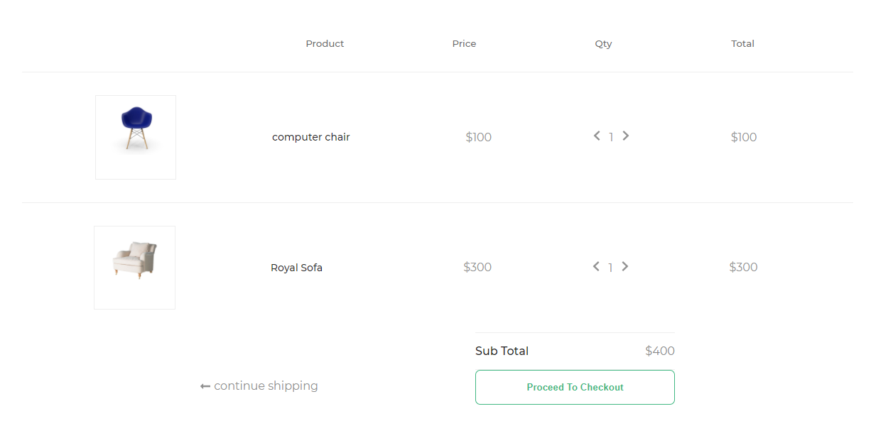

## Live Demo

# [Furnish](https://furnish-shop.herokuapp.com)







## What I have used?

- Node.js
- Express
- React.js
- Redux
- MongoDB Atlas


## Quick Start 🚀 🚀 🚀

```
# set all environment variables below in .env file

- MONGO_URI

- FILE_UPLOAD_PATH

- JWT_SECRET

- JWT_EXPIRE

- JWT_COOKIE_EXPIRE

- CLOUD_NAME

- CLOUD_API_KEY

- CLOUD_API_SECRET

# keep your .env file in cofig folder

# add uri of your mongodb connection for example

 "MONGO_URI": "mongodb://localhost:27017/furnish",
 
```

```bash
# Install server dependencies
npm install

# Install client dependencies
cd client
npm install

# Run both Express & React from root
npm run dev

# Build for production
cd client
npm run build
```

Open [http://localhost:3000](http://localhost:3000) with your browser to see the result.